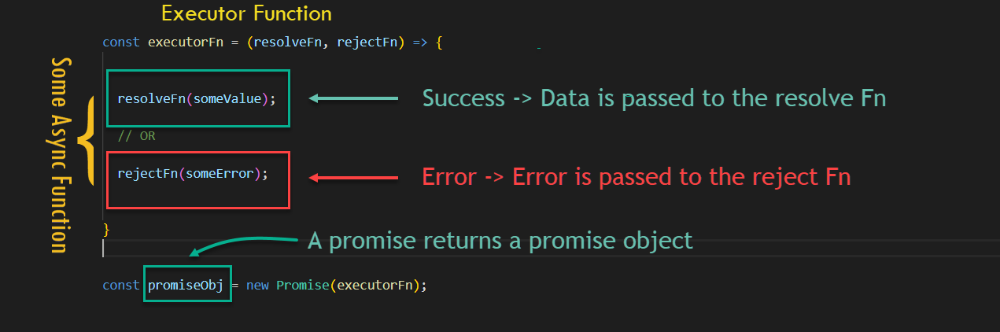

# W2D4 Lecture - Promises

## Content

- Async flow with callbacks
- Exception handling
- Error handling with an async flow with callbacks
- Using promises

## Async flows with callbacks

- We can use callbacks to handle async functions
- Tradition error handling won't work with async functions (cannot catch errors with try catch)
- Multiple nested callbacks can lead to **callback hell**

## Using promises

- Promises suggest a better syntax to handle callbacks
- Multiple async calls can be handled more gracefully
- Promise can either be **resolved** or **rejected**

## What are promises

- promise of a future value

### promises state

1. pending
2. Fulfilled
3. Rejected

- [Promise States](./JavaScript-Promise-state.png)

### 2 parts

1. Executor Function
2. Consuming the promise

#### Executor Function

#### Consuming the promise

## References

- [The Definitive Guide to the JavaScript Promises](https://www.javascripttutorial.net/es6/javascript-promises/)
- [JavaScript Visualized: Promises & Async/Await](https://dev.to/lydiahallie/javascript-visualized-promises-async-await-5gke)