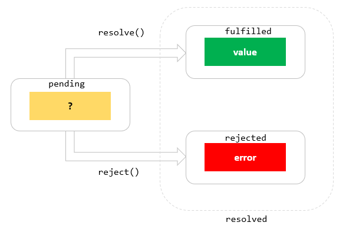
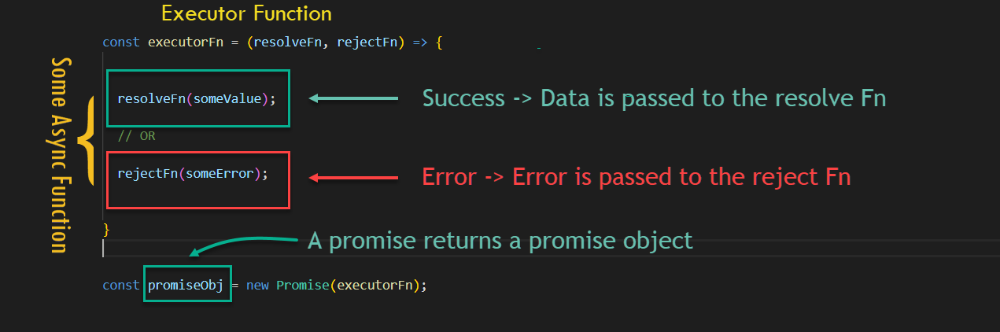

# W2D4 Lecture - Promises

## Content

- Async flow with callbacks
- Exception handling
- Error handling with an async flow with callbacks
- Using promises

## Async flows with callbacks

- We can use callbacks to handle async functions
- Tradition error handling won't work with async functions (cannot catch errors with try catch)
- Multiple nested callbacks can lead to **callback hell** [Breakout exercise](https://gist.github.com/DominicTremblay/311014069b5ce616b5ccf4792a362910)

## Using promises

- Promises suggest a better syntax to handle callbacks
- Multiple async calls can be handled more gracefully
- Promise can either be **resolved** or **rejected**

## What are promises

- promise of a future value

### Promise States

- Pending
- Fulfilled
- Rejected

### A promise has 2 parts

1. Executor Function
2. Consuming the promise

#### Executor Function

#### Consuming the promise

